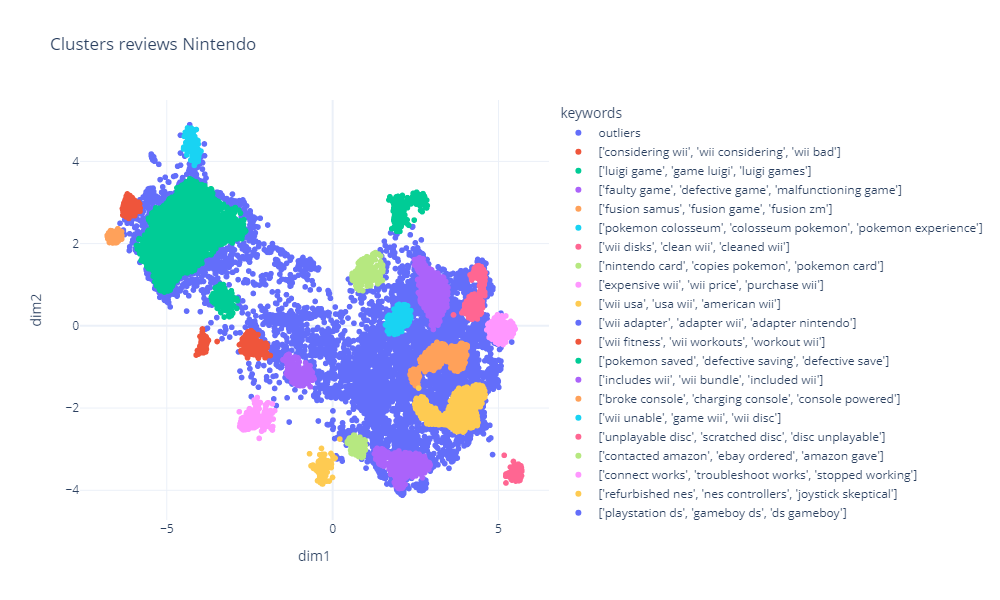
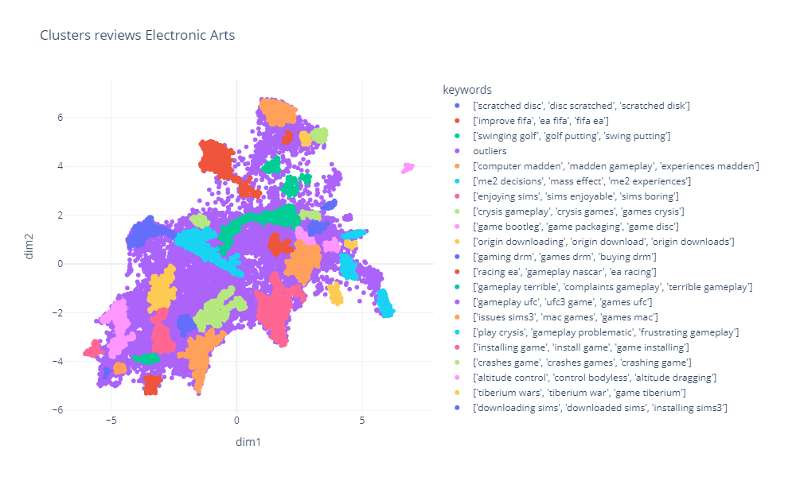
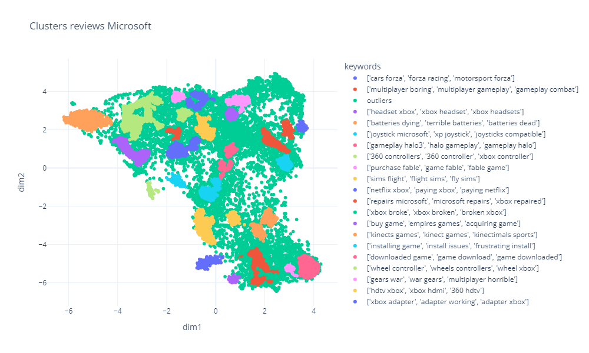
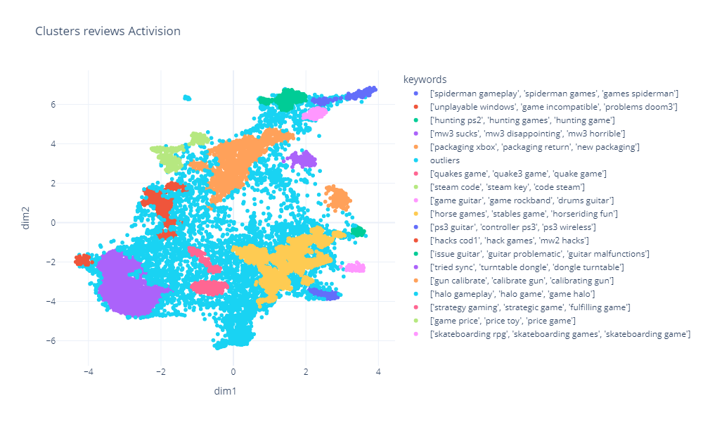
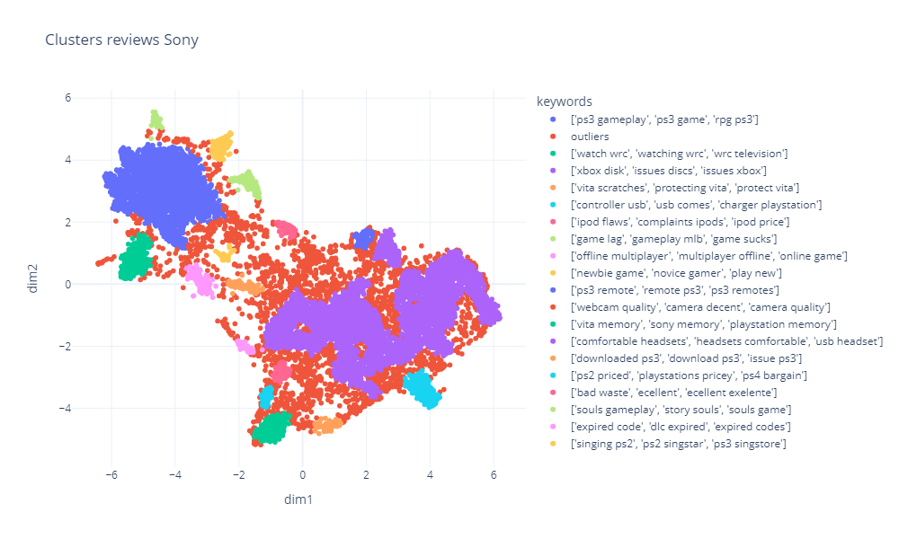

# Extracting Business Insights from Amazon Reviews Using NLP

Developed a comprehensive NLP project focused on extracting actionable business insights from Amazon reviews of video games. Initially, the sentiment of each review was analyzed to identify negative feedback, utilizing a BERT based model. Following this, an embedding model was applied to transform the reviews into embeddings, facilitating the nuanced understanding of customer opinions beyond mere positive or negative sentiment. Leveraging UMAP for dimensionality reduction and HDBSCAN for clustering, the project effectively grouped reviews into distinct clusters, enabling a focused analysis on specific aspects of customer dissatisfaction. 

## Code Walkthrough

| Component         | Link                                                                                                                       |
|-------------------|---------------------------------------------------------------------------------------------------------------------------- |
| Upload Raw data to HuggingFace       | [data_prep_notebooks/upload_dataset_to_gcs.ipynb](https://github.com/jjovalle99/AmazonNLP/blob/c882ab82139ed2110c16ec18741b9711ed47e9a8/data_prep_notebooks/upload_dataset_to_gcs.ipynb)               |
| Upload data from HugginFace to GCS  | [upload_dataset_to_hugging_face.ipynb](https://github.com/jjovalle99/AmazonNLP/blob/c882ab82139ed2110c16ec18741b9711ed47e9a8/data_prep_notebooks/upload_dataset_to_hugging_face.ipynb)          |
| Sentiment Analysis  | [01_sentiment_analysis.ipynb](https://github.com/jjovalle99/AmazonNLP/blob/c882ab82139ed2110c16ec18741b9711ed47e9a8/01_sentiment_analysis.ipynb)          |
| Clusters | [02_clusters.ipynb](https://github.com/jjovalle99/AmazonNLP/blob/c882ab82139ed2110c16ec18741b9711ed47e9a8/02_clusters.ipynb)          |


## Bonus: GCS to BQ
```
CREATE OR REPLACE TABLE `amazon_reviews.modeling_data` AS 
SELECT 
  TRIM(r.reviewText, " ") as review,
  TRIM(m.brand, " ") as brand,
  m.category.list[OFFSET(0)].item AS first_category_item
FROM 
  `valid-dragon-397303.amazon_reviews.reviews` r
INNER JOIN
  `valid-dragon-397303.amazon_reviews.metadata` m
ON
  r.asin = m.asin
WHERE 
  TRIM(r.reviewText, " ") IS NOT NULL AND
  TRIM(m.brand, " ") IS NOT NULL AND
  ARRAY_LENGTH(m.category.list) > 0
;
```

## Results:

#### Nintendo


#### EA


#### Microsoft


#### Activision


#### Sony

